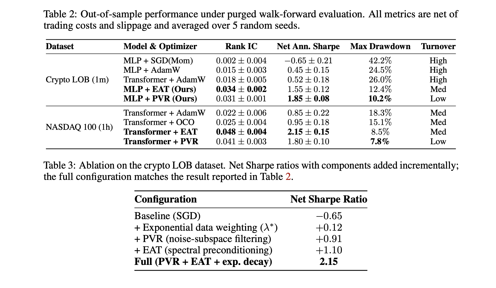

# Deep Learning under Continuous Distribution Shift (NS-NTK)

[Paper](20260527.pdf)

Official implementation for the paper: **"Deep Learning under Continuous Distribution Shift: The Non-Stationary NTK and Spectral Tracking SDE for Quantitative Finance"**.

Contains PVR and EAT optimizers, Exponential Aggregation samplers, and Temporal Transformers.

